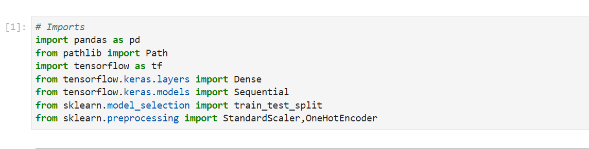
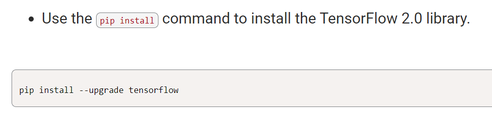
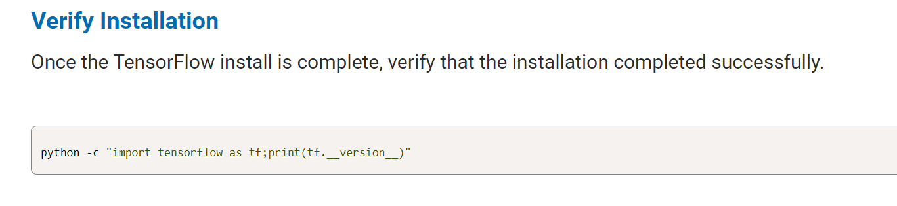
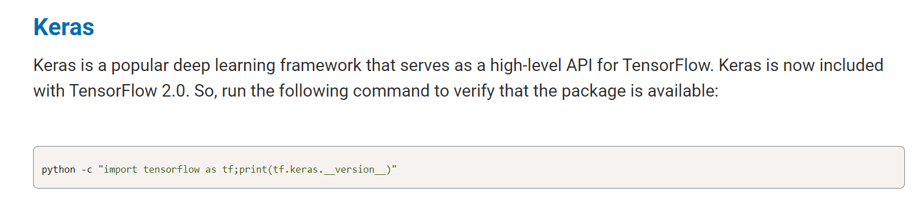
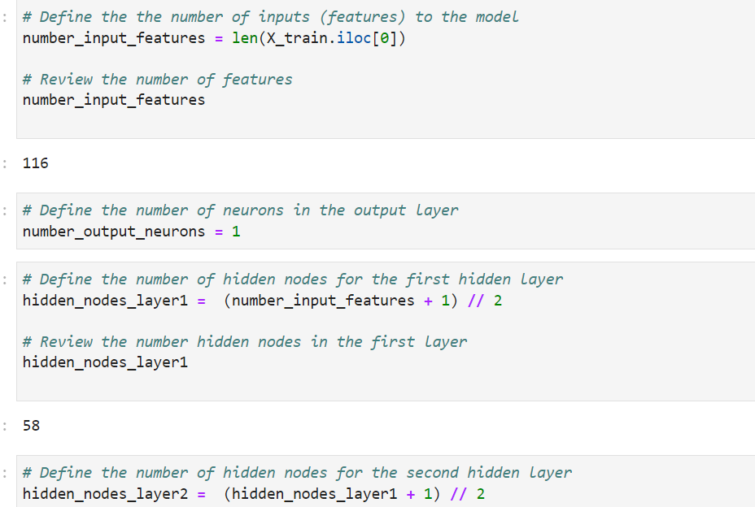
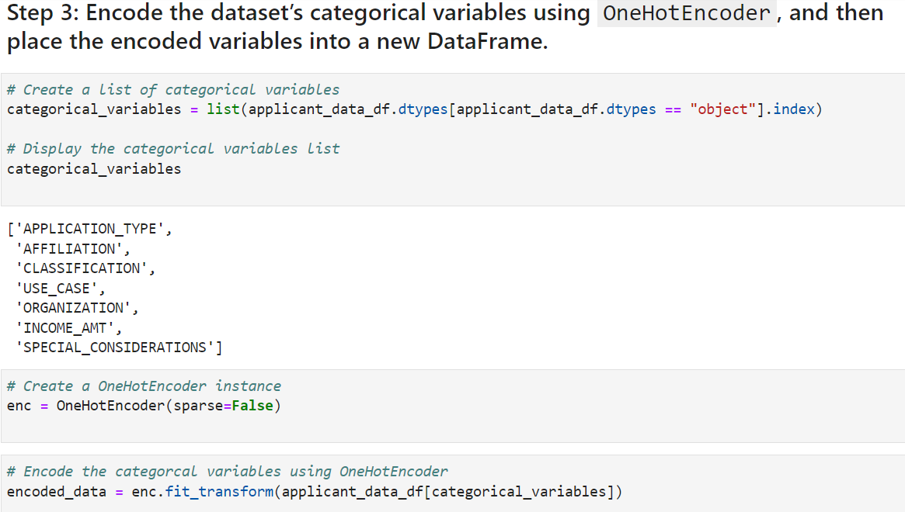

# Venture-Funding-With-Deep-Learning
I work as a risk management associate at Alphabet Soup, a venture capital firm. Alphabet Soup’s business team receives many funding applications from startups every day. This team has asked me to help them create a model that predicts whether applicants will be successful if funded by Alphabet Soup.

The business team has given me a CSV file containing more than 34,000 organizations that have received funding from Alphabet Soup over the years. The CSV file contains a variety of information about each business, including whether or not it ultimately became successful. With your knowledge of machine learning and neural networks, you decide to use the features in the provided dataset to create a binary classifier model that will predict whether an applicant will become a successful business.

To predict whether Alphabet Soup funding applicants will be successful, I creatde a binary classification model using a deep neural network.

This challenge consists of three technical deliverables.

- Preprocess data for a neural network model.

- Use the model-fit-predict pattern to compile and evaluate a binary classification model.

- Optimize the model.

## Technologies
Resources included 1 csv file:

(Resources/applicants_data.csv)

Tools

Libraries and dependencies:

import pandas as pd
from pathlib import Path
import tensorflow as tf
from tensorflow.keras.layers import Dense
from tensorflow.keras.models import Sequential
from sklearn.model_selection import train_test_split
from sklearn.preprocessing import StandardScaler,OneHotEncoder

## Installation Guide
Installation requirements for this project included Python and Panda Libraries, TensorFlow and Keras:

pip install --upgrade tensorflow
python -c "import tensorflow as tf;print(tf.__version__)"
python -c "import tensorflow as tf;print(tf.keras.__version__)"

## Results
Creating a Neural Network

OndHotEncoder

When Utilizing Deep Learning modeling methods, there are ways to calculation optimization but other times optimization can only be found with trial and error such as changing the number of hidden nodes, output activation and number of epochs. By changing these numbers in a few scenerios I was able to improve the accuracy score by decreasing the hidden nodes but increasing the epochs. Changing the activation in this case, decreased the accuracy substainially. nn_A2 was ultimately the best model of the 3 for this particular dataset. 
1

## Contributors

#### Contact
zehra.vahidy@gmail.com
LinkedIn https://www.linkedin.com/in/zehra-vahidy-6025b820

---

## License

Unlicesened

## Appendix
https://docs.github.com/en/get-started/writing-on-github/getting-started-with-writing-and-formatting-on-github/basic-writing-and-formatting-syntax#headings
https://jupyterlab.readthedocs.io/en/stable/
